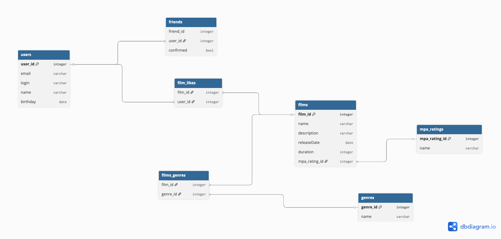

# java-filmorate
Template repository for Filmorate project.


```sql
Table users {
  user_id integer [primary key]
  email varchar
  login varchar
  name varchar
  birthday date
}

Table friends {
  friend_id integer
  user_id integer 
  confirmed bool
}

Table films {
  film_id integer [primary key]
  name varchar
  description varchar
  release_date date
  duration integer
  mpa_rating_id integer

}

Table film_likes {
  film_id integer
  user_id integer
}

Table films_genres {
  film_id integer
  genre_id integer
}

Table genres {
  genre_id integer [primary key]
  name varchar
}

Table mpa_ratings {
  mpa_rating_id integer [primary key]
  name varchar
}


Ref users_friends: friends.user_id > users.user_id 

Ref users_likes: film_likes.user_id > users.user_id

Ref film_likes: film_likes.film_id > films.film_id

Ref genre_films: films.film_id < films_genres.film_id

Ref genre_films: genres.genre_id < films_genres.genre_id

Ref rating_films: mpa_ratings.mpa_rating_id < films.mpa_rating_id
```

## Запросы

#### 1. Добавление фильма
```sql
INSERT INTO films (name,description,release_date,duration,mpa_rating_id)
VALUES ('Тестовый фильм','Тестовое описание','1985-07-03',116,3);
```
#### 2. Выбрать все фильмы с рейтингом PG-13
```sql
SELECT f*, mpa.name
FROM films AS f
INNER JOIN mpa_ratings AS mpa ON f.film_id = mpa.film_id
WHERE mpa.name = 'PG-13';
```

#### 3. Просмотр друзей пользователя
```sql
SELECT u*
FROM users AS u
INNER JOIN users_friends AS uf ON u.user_id = uf.friend_id
WHERE uf.user_id = 1 AND confirmed = true;
```

#### 4. Создание жанра
```sql
INSERT INTO genres (name)
VALUES ('Комедия');
```

#### 5. Добавление жанра к фильму
```sql
INSERT INTO films_genres (film_id, genre_id)
VALUES (1, 2);
```

#### 6. Поставить лайк фильму
```sql
INSERT INTO film_likes (film_id, user_id)
VALUES (1, 10);
```