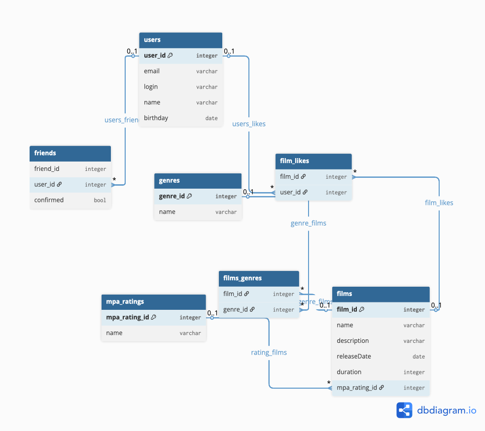

# java-filmorate
Template repository for Filmorate project.

Table users {
  user_id integer [primary key]
  email varchar
  login varchar
  name varchar
  birthday date
}

Table friends {
  friend_id integer
  user_id integer 
  confirmed bool
}

Table films {
  film_id integer [primary key]
  name varchar
  description varchar
  releaseDate date
  duration integer
  genre_id integer
  mpa_rating_id integer

}

Table film_likes {
  film_id integer
  user_id integer
}

Table films_genres {
  film_id integer
  genre_id integer
}

Table genres {
  genre_id integer [primary key]
  name varchar
}

Table mpa_ratings {
  mpa_rating_id integer [primary key]
  name varchar
}

Ref users_friends: friends.user_id > users.user_id 

Ref users_likes: film_likes.user_id > users.user_id

Ref film_likes: film_likes.film_id > films.film_id

Ref genre_films: films.film_id < films_genres.film_id

Ref genre_films: genres.genre_id < films_genres.genre_id

Ref rating_films: mpa_ratings.mpa_rating_id < films.mpa_rating_id
